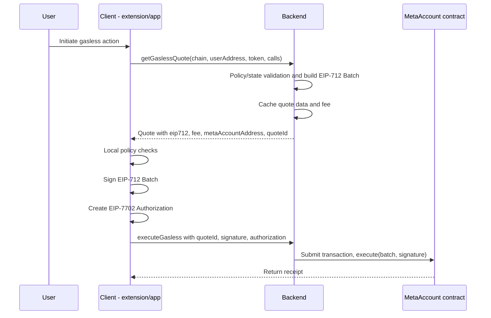

# Smart Accounts

[](https://permutize.github.io/smart-accounts/coverage/)
[](LICENSE)
[](https://github.com/permutize/smart-accounts/actions/workflows/ci.yml)

A comprehensive smart account implementation with EIP-7702 compatibility, meta-transactions, and automated fee management.

## Overview

This project implements a sophisticated smart account system featuring:

- **BaseAccount**: Core EIP-7702-compatible account with batched calls and EIP-712 signing
- **MetaAccount**: Fee-enabled smart account with automatic fee collection for relayers
- **FeeManager**: Configurable fee management system with oracle-based pricing
- **IncrementalNonce**: Efficient nonce management for batched transactions

## Integration Flow (Gasless)

The end-to-end gasless transfer flow spans client, backend, MetaAccount, and the network.

### Sequence Diagram



## Contracts Docs

See `docs/core-contracts.md` for detailed documentation of:
- `BaseAccount.sol` – execution, signatures, nonces, events, errors
- `FeeManager.sol` – token registry, fee rules, admin functions
- `IncrementalNonces.sol` – monotonic nonces and checked consumption

## Key Features

### 🔐 **EIP-7702 Compatible Accounts**
- EIP-712 domain separation for secure cross-chain protection
- Batched transaction execution with single signature
- Incremental nonce management for flexible transaction ordering

### 💰 **Automated Fee Management**
- Oracle-based dynamic fee calculation
- Support for multiple ERC-20 fee tokens
- Configurable price markup and staleness protection
- Gas cost estimation for accurate fee collection

### 🚀 **Meta-Transaction Support**
- Relayer-friendly architecture with guaranteed fee collection
- First-call fee validation ensures relayer compensation
- Signature-based execution for gasless user experience


## Deployments

### Sepolia

| Contract | Address |
| -------- | ------- |
| MetaAccount | 0xf4f01977A80e876558dB805B8d2987B21CecA2Ad |
| FeeManager | 0x391F11D2f0c9B5eaAD57d7f748Fc58f9C3c31006 |
| NonceManager | 0xE608E933E1842a52ABf91A14C481bBe87Cf31B69 |


### Monad Testnet

| Contract | Address |
| -------- | ------- |
| MetaAccount | 0x5eb7cdc494689bd2ed8c7b0783943870d14cc2e2 |
| FeeManager | 0x01385048c81424bbF4C23dCeDa7A70aaE7092A48 |
| NonceManager | 0xbB66Ce807781C7BEF91b97c3C10529e16373c8F0 |

## Architecture

```
src/
├── account/
│   └── MetaAccount.sol          # Fee-enabled smart account
├── core/
│   ├── BaseAccount.sol          # Core account functionality
│   ├── FeeManager.sol           # Fee calculation and management
│   └── IncrementalNonce.sol     # Nonce management system
├── interfaces/                  # Contract interfaces
├── libraries/
│   └── CallHash.sol            # EIP-712 call hashing utilities
...
```

## Prerequisites

- [Foundry](https://book.getfoundry.sh/getting-started/installation)
- [Bun](https://bun.sh/) (or Node.js)

## Installation

1. Clone the repository:

```sh
git clone <repository-url>
cd smart-accounts
```

2. Install dependencies:

```sh
bun install
```

## Environment Setup

Create a `.env` file in the root directory:

```sh
ALCHEMY_API_KEY=your_alchemy_api_key
API_KEY_ETHERSCAN=your_etherscan_api_key
API_KEY_BSCSCAN=your_bscscan_api_key
KEYSTORE_ACCOUNT=deployer
```

# Testing
```
bun run test
```

## Security Considerations

- All contracts use OpenZeppelin's security primitives
- Reentrancy protection on critical functions
- Oracle staleness validation prevents stale price attacks
- EIP-712 signatures prevent replay attacks across chains
- Fee validation ensures relayer compensation

## Contributing

1. Fork the repository
2. Create a feature branch
3. Add comprehensive tests
4. Ensure all tests pass
5. Submit a pull request

## License

This project is licensed under the GNU General Public License v3.0 or later (GPL-3.0-or-later).  
See the [LICENSE](./LICENSE) file for details.
